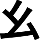
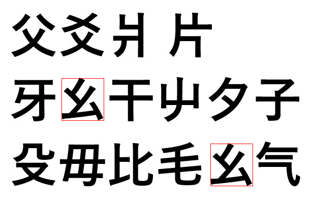
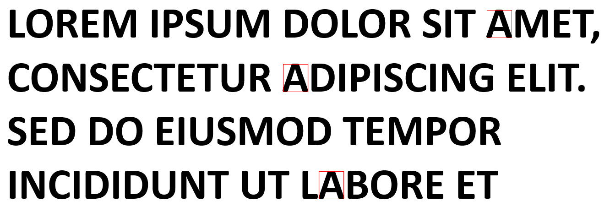
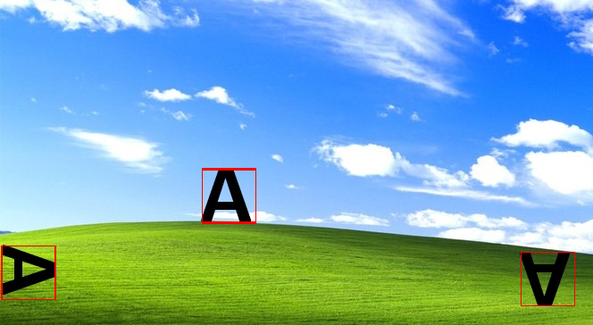

# Wykrywanie Obiektów i Ich Segmentacja

## Opis Projektu
Program oparty na CUDA służący do wykrywania obiektów na obrazach i ich zaznaczenie. Pozwala na detekcję templatów wczytanych z pliku na obrazach. Program radzi sobie z wykrywaniem kształtów takich jak litery, symbole, dowolne znaki specjalne, bądź loga pod różnymi kątami i różnych wielkości. Plikiem wyjściowym jest zdjęcie z szukanymi znakami oznaczonymi bounding boxami. 

## Przykłady Działania
Poniższy przykład pokazuje wykorzystanie programu do znalezienia znaku chińskiego alfabetu, co może być wykorzystywane w analizie tekstów złożonych języków.

Output programu po wykryciu powyższego templatu:

Przykładowe outputy programu po wykryciu litery A:

## Przykładowe Funkcje Wykorzystywane w Projekcie
- Ładowanie i zapisywanie obrazów za pomocą biblioteki stb_image
- Przetwarzanie obrazów: konwersja na skale szarości, wykrywanie przezroczystości
- Rotacja obrazu
- Zmiana rozmiaru obrazów
- Detekcja obiektów: wykrywanie określonych obiektów w obrazie
- Tworzenie bounding boxów na obrazie
- Zmiana kolorów bounding boxów w zależności od histogramu kolorów zdjęcia by były widoczne

## Autorzy
- Maksym Małek 188809
- Oliwer Lisek 188947
- Jakub Dobruchowski 188868
- Przemysław Piątkiewicz 188823
  
